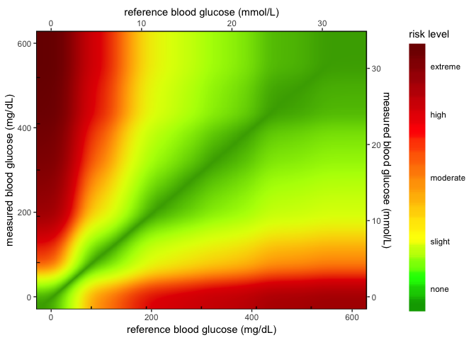
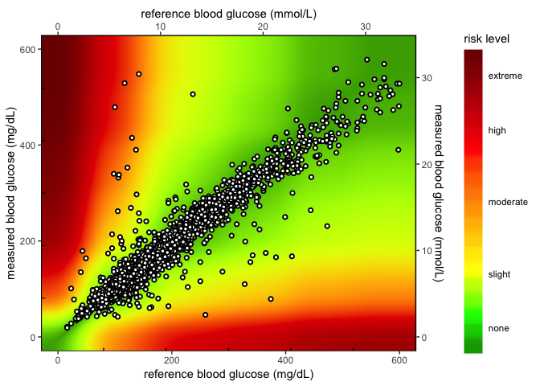

SEG - ggplot2
================
Martin Frigaard

# Data inputs

In order to create these graphs, I need to load a few data sets from
Github.

``` r
# HEAT MAP DATA INPUTS ============= ----
# upload AppRiskPairData.csv from github  ---- ---- ---- ----
github_root <- "https://raw.githubusercontent.com/"
app_riskpair_repo <- "mjfrigaard/SEG_shiny/master/Data/AppRiskPairData.csv"
# download to data repo
if (!file.exists("data/")) {
  dir.create("data/")
}
utils::download.file(url = paste0(github_root, app_riskpair_repo), 
                     destfile = "data/Riskpairdata.csv")
# sample measure data
samp_meas_data_rep <- "mjfrigaard/SEG_shiny/master/Data/FullSampleData.csv"
utils::download.file(url = paste0(github_root, samp_meas_data_rep), 
                     destfile = "data/Sampledata.csv")
# Read in the RiskPairData & SampMeasData
RiskPairData <- readr::read_csv(file = "data/Riskpairdata.csv")
SampMeasData <- readr::read_csv(file = "data/Sampledata.csv")
```

## The `RiskPairData`

This data has columns and risk pairs for both `REF` and `BGM`, and the
`RiskFactor` variable for each pair of `REF` and `BGM` data.

``` r
RiskPairData %>% dplyr::glimpse(78)
```

    ## Observations: 361,201
    ## Variables: 5
    ## $ RiskPairID <dbl> 1, 2, 3, 4, 5, 6, 7, 8, 9, 10, 11, 12, 13, 14, 15, 16,...
    ## $ REF        <dbl> 0, 1, 2, 3, 4, 5, 6, 7, 8, 9, 10, 11, 12, 13, 14, 15, ...
    ## $ BGM        <dbl> 0, 0, 0, 0, 0, 0, 0, 0, 0, 0, 0, 0, 0, 0, 0, 0, 0, 0, ...
    ## $ RiskFactor <dbl> 0, 0, 0, 0, 0, 0, 0, 0, 0, 0, 0, 0, 0, 0, 0, 0, 0, 0, ...
    ## $ abs_risk   <dbl> 0, 0, 0, 0, 0, 0, 0, 0, 0, 0, 0, 0, 0, 0, 0, 0, 0, 0, ...

Below you can see a sample of the `REF`, `BGM`, `RiskFactor`, and
`abs_risk` variables.

``` r
RiskPairData %>% 
  dplyr::sample_n(size = 10) %>% 
  dplyr::select(REF, BGM, RiskFactor, abs_risk)
```

    ## # A tibble: 10 x 4
    ##      REF   BGM RiskFactor abs_risk
    ##    <dbl> <dbl>      <dbl>    <dbl>
    ##  1    54    33      0.672    0.672
    ##  2   194   100      1.22     1.22 
    ##  3   518   319      0.611    0.611
    ##  4   464   378      0.338    0.338
    ##  5   407   152      1.52     1.52 
    ##  6   184   210     -0.295    0.295
    ##  7   292   250      0.204    0.204
    ##  8     2   263     -3.45     3.45 
    ##  9   407   167      1.46     1.46 
    ## 10   597     8      3.30     3.30

## The `SampMeasData`

This data set mimics a blood glucose monitor, with only `BGM` and `REF`
values.

``` r
SampMeasData %>% dplyr::glimpse(78)
```

    ## Observations: 7,857
    ## Variables: 2
    ## $ BGM <dbl> 121, 212, 161, 191, 189, 293, 130, 147, 83, 132, 146, 249, 11...
    ## $ REF <dbl> 127, 223, 166, 205, 210, 296, 142, 148, 81, 131, 155, 254, 12...

# Motivation

This document creates the `ggplot2` heatmap in the [SEG
application](https://www.diabetestechnology.org/seg/). In earlier
versions of the application, the heatmap background wasn’t smoothed like
the Excel application, so I decided to write up how I changed the graph
using a pre-made .png image.

## The original (Excel) SEG image

This image is from the Excel application.

<!-- -->

What we ended up with was this:

## The `ggplot2` image

When we re-create the graph using the risk pair data, we get this.

<!-- -->

This is because of the relationship between `RiskFactor`, `BGM` and
`REF` values.

## `RiskFactor` vs. `BGM`/`REF`

If we look at `RiskFactor` as a function of `seg_val`, we see the
following.

``` r
RiskPairData %>% 
  tidyr::gather(key = "seg_key", 
                value = "seg_val", 
                c(REF, BGM)) %>% 
  ggplot(aes(x = seg_val, y = RiskFactor, group = seg_key)) + 
    geom_point(aes(color = seg_key), alpha = 1/8, size = 0.5)
```

<!-- -->

The values of `RiskFactor` do not change much for the `BGM` and `REF`
values of 400-450, 450-500, and 500-600.

## Plot `abs_risk` VS `REF`/`BGM`

``` r
RiskPairData %>% 
  tidyr::gather(key = "seg_key", 
                value = "seg_val", 
                c(REF, BGM)) %>% 
  ggplot(aes(x = seg_val, y = abs_risk, group = seg_key)) + 
    geom_point(aes(color = seg_key), alpha = 1/8, size = 0.5)
```

<!-- -->

The same lines are seen when the absolute value of `RiskFactor` is
plotted against the `BGM` and `REF` values.

This explains why the plot below looks the way it does. The sharp lines
are a result of the minimal change in `RiskFactor` (or `abs_risk`) for
BGM and REF values of 400-450, and 500-600.

``` r
RiskPairData %>% 
  ggplot2::ggplot(aes(x = REF, 
                      y = BGM,
                      color = abs_risk)) + 
  ggplot2::geom_point()
```

<!-- -->

## The Guassian smoothed image

This is the image from Josh Senyak.

<!-- -->

## Define `mmlConvFactor`

Define the `mmolConvFactor`.

``` r
# mmol conversion factor ---- ---- ---- ---- ---- ---- ----
mmolConvFactor <- 18.01806
```

## Create `rgb2hex` function and set colors

Add the `rgb2hex` function and choose the red -\> green colors for
scale.

``` r
# rgb2hex function ---- ---- ---- ---- ---- ---- ---- ---- ---- 
# This is the RGB to Hex number function for R
rgb2hex <- function(r, g, b) rgb(r, g, b, maxColorValue = 255)

# risk factor colors ---- ---- ---- ---- ---- ---- ---- ---- ----
# These are the values for the colors in the heatmap.
abs_risk_0.0000_color <- rgb2hex(0, 165, 0)
# abs_risk_0.0000_color
abs_risk_0.4375_color <- rgb2hex(0, 255, 0)
# abs_risk_0.4375_color
abs_risk_1.0625_color <- rgb2hex(255, 255, 0)
# abs_risk_1.0625_color
abs_risk_2.7500_color <- rgb2hex(255, 0, 0)
# abs_risk_2.7500_color
abs_risk_4.0000_color <- rgb2hex(128, 0, 0)
# abs_risk_4.0000_color
riskfactor_colors <- c(
  abs_risk_0.0000_color,
  abs_risk_0.4375_color,
  abs_risk_1.0625_color,
  abs_risk_2.7500_color,
  abs_risk_4.0000_color
)
```

## Base layer + color gradient

The base layer color gradient are built below. The base data frame only
exists to give the x/y coordinates at this stage.

``` r
# create base_data data frame ---- ---- ---- ---- ---- ---- ---- 
base_data <- data.frame(
  x_coordinate = 0,
  y_coordinate = 0,
  color_gradient = c(0:4)
)
# base layer ---- ---- ---- ---- ---- ---- ---- ----
base_layer <- ggplot() +
  geom_point(
    data = base_data, # defines data frame
    aes(
      x = x_coordinate,
      y = y_coordinate,
      fill = color_gradient
    )
  ) # + # uses x, y, color_gradient
base_layer
```

<!-- -->

This is simple plot is only the color gradient, so no data are added to
the graph.

## Adding the risk layer

This sets the `abs_risk` as the color gradient, vs. manually setting it
with the `base_layer` below.

``` r
# risk pair data layer  ---- ---- ---- ---- ---- ---- ---- ----
# RiskPairData %>% glimpse(78)
risk_layer <- base_layer +
  geom_point(
    data = RiskPairData, # new data set
    aes(
      x = REF, # additional aesthetics from new data set
      y = BGM,
      color = abs_risk
    ),
    show.legend = FALSE
  )
risk_layer
```

<!-- -->

Note the less than smooth transitions between the x and y coordinates.

### The `risk level` gradient

This is for the gradient scale on the side.

``` r
# add fill gradient  ---- ---- ---- ---- ---- ---- ---- ---- ---- 
risk_level_color_gradient <- risk_layer +
  ggplot2::scale_fill_gradientn( # scale_*_gradientn creats a n-color gradient
    values = scales::rescale(c(
      0, # darkgreen
      0.4375, # green
      1.0625, # yellow
      2.75, # red
      4.0 # brown
    )), 
    limits = c(0, 4),
    colors = riskfactor_colors,
    guide = guide_colorbar(
      ticks = FALSE,
      barheight = unit(100, "mm")
    ),
    breaks = c(
      0.25,
      1,
      2,
      3,
      3.75
    ),
    labels = c(
      "none",
      "slight",
      "moderate",
      "high",
      "extreme"
    ),
    name = "risk level"
  )
risk_level_color_gradient
```

<!-- -->

## The SEG grid without data

These are the `REF` and `BGM` values without any sample data added.

``` r
# add color gradient  ---- ---- ---- ---- ---- ---- ---- ---- ---- 
# Add the new color scales to the scale_y_continuous()
heatmap_plot <- risk_level_color_gradient +
  ggplot2::scale_color_gradientn(
    colors = riskfactor_colors, # these are defined above with rgb2hex function
    guide = "none",
    limits = c(0, 4),
    values = scales::rescale(c(
      0, # darkgreen
      0.4375, # green
      1.0625, # yellow
      2.7500, # red
      4.0000
    ))
  ) +
  ggplot2::scale_y_continuous(
    limits = c(0, 600),
    sec.axis =
      sec_axis(~. / mmolConvFactor,
        name = "measured blood glucose (mmol/L)"
      ),
    name = "measured blood glucose (mg/dL)"
  ) +
  scale_x_continuous(
    limits = c(0, 600),
    sec.axis =
      sec_axis(~. / mmolConvFactor,
        name = "reference blood glucose (mmol/L)"
      ),
    name = "reference blood glucose (mg/dL)"
  )
heatmap_plot
```

<!-- -->

## Add sample data to heatmap

Below are the sample blood glucose measurements in the plot.

``` r
# add SampMeasData to heatmap_plot ---- ---- ---- ---- ---- ---- 
# sample measure data import ---- 
# Add the data to heatmap_plot
heat_map_1.0 <- heatmap_plot +
  geom_point(
    data = SampMeasData, # introduce sample data frame
    aes(
      x = REF,
      y = BGM
    ),
    shape = 21,
    fill = "white",
    size = 1.2,
    stroke = 1
  )
heat_map_1.0
```

<!-- -->

``` r
# export heat_map_1.0 -----------------------------------------------------
ggplot2::ggsave(filename = 
                  base::paste0("Image/", 
                               base::noquote(lubridate::today()),
                               "-heat_map_1.0.png"), device = "png")
```

# Use Gaussian image with `ggplot2` background

I only need the smoothed image for a background, so I will crop this up
a bit. Then I can convert it to a `.jpg` and read it back into RStudio
using `png::readPNG()`.

``` r
library(jpeg)
library(png)
# 1) read in as png
BackgroundSmooth <- png::readPNG("image/BackgroundSmooth.png")
```

This new plot

``` r
base_layer <- ggplot() +
  geom_point(
    data = base_data, # defines data frame
    aes(
      x = x_coordinate,
      y = y_coordinate,
      fill = color_gradient
    )
  )
gaussian_layer <- base_layer +
  ggplot2::annotation_custom(
    grid::rasterGrob(image = BackgroundSmooth, 
                               width = unit(1,"npc"), 
                               height = unit(1,"npc")), 
                               -Inf, Inf, -Inf, Inf) +
    # these are the points 
    ggplot2::geom_point(shape = 21, 
                        fill = "white",
                        size = 1.2, 
                        stroke = 1) +
  ggplot2::scale_fill_gradientn( # scale_*_gradientn creats a n-color gradient
    values = scales::rescale(c(
      0, # darkgreen
      0.4375, # green
      1.0625, # yellow
      2.75, # red
      4.0 # brown
    )), 
    limits = c(0, 4),
    colors = riskfactor_colors,
    guide = guide_colorbar(
      ticks = FALSE,
      barheight = unit(100, "mm")
    ),
    breaks = c(
      0.25,
      1,
      2,
      3,
      3.75
    ),
    labels = c(
      "none",
      "slight",
      "moderate",
      "high",
      "extreme"
    ),
    name = "risk level"
  ) +
  ggplot2::scale_color_gradientn(
    colors = riskfactor_colors, # these are defined above with rgb2hex function
    guide = "none",
    limits = c(0, 4),
    values = scales::rescale(c(
      0, # darkgreen
      0.4375, # green
      1.0625, # yellow
      2.7500, # red
      4.0000
    ))
  ) +
  ggplot2::scale_y_continuous(
    limits = c(0, 600),
    sec.axis =
      sec_axis(~. / mmolConvFactor,
        name = "measured blood glucose (mmol/L)"
      ),
    name = "measured blood glucose (mg/dL)"
  ) +
  scale_x_continuous(
    limits = c(0, 600),
    sec.axis =
      sec_axis(~. / mmolConvFactor,
        name = "reference blood glucose (mmol/L)"
      ),
    name = "reference blood glucose (mg/dL)"
  ) 
gaussian_layer
```

<!-- -->

Now I can add the sample data to the new `gaussian_layer`.

``` r
heat_map_2.0 <- gaussian_layer + 
  geom_point(
    data = SampMeasData, # introduce sample data frame
    aes(
      x = REF,
      y = BGM
    ),
    shape = 21,
    fill = "white",
    size = 1.2,
    stroke = 1
  )
heat_map_2.0
```

<!-- -->

Now I just need to add this to the applcation.
