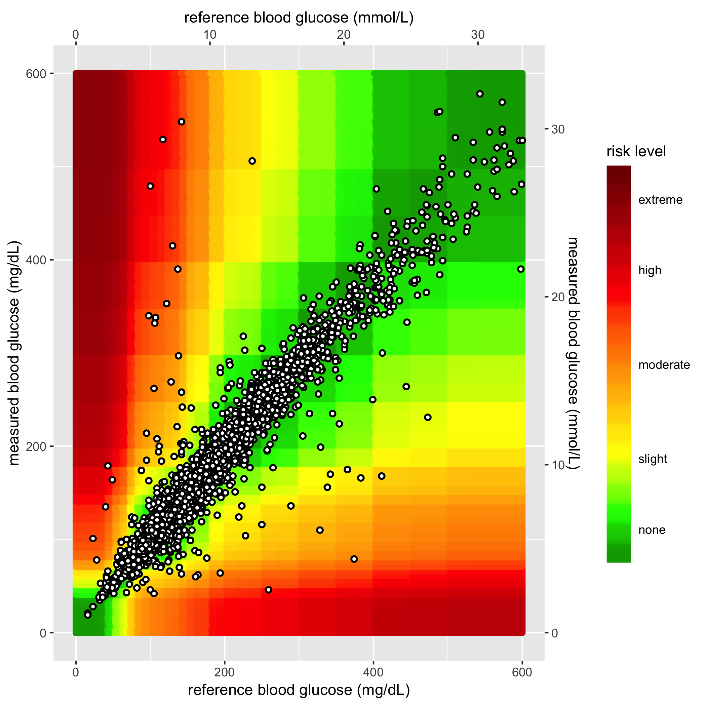
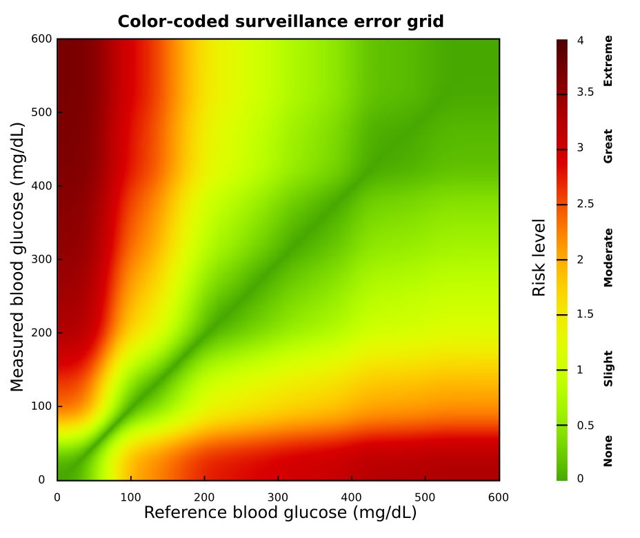
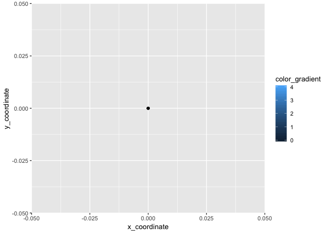
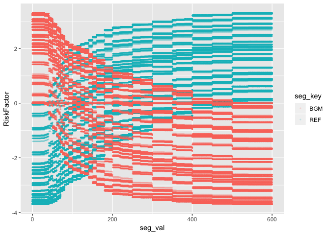
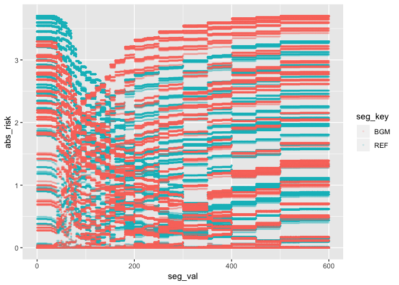
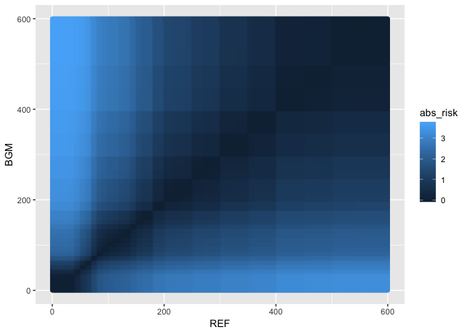
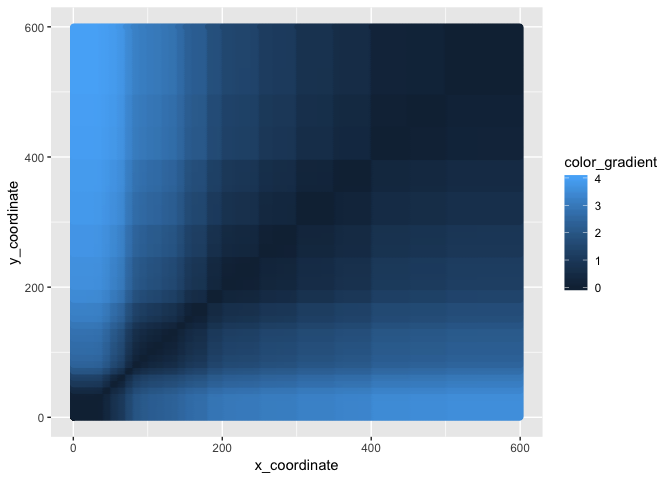
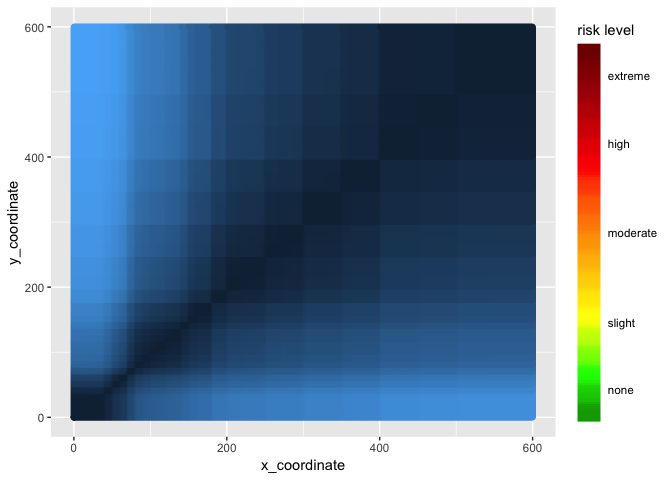
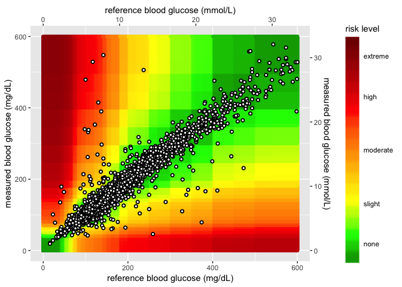

SEG - ggplot2
================
Martin Frigaard

# Motivation

This document creates the `ggplot2` heatmap in the [SEG
application](https://www.diabetestechnology.org/seg/). In earlier
versions of the application, the heatmap didn’t look quite like the DTS
folks wanted, so I decided to write up how I changed the heatmap using a
pre-made .png image.

The goal is to make the heatmaps above look something like this:

<!-- -->

What we ended up with was this:

<!-- -->

Now we have a blank background image.

<!-- -->

## Download and read in the data

In order to create these graphs, I need to load a few data sets from
Github.

``` r
# 5 - HEAT MAP DATA INPUTS ============= ----
# 5.0 upload AppRiskPairData.csv from github  ---- ---- ---- ----
github_root <- "https://raw.githubusercontent.com/"
app_riskpair_repo <- "mjfrigaard/SEG_shiny/master/Data/AppRiskPairData.csv"
# download to data repo
if (!file.exists("data/")) {
  dir.create("data/")
}
utils::download.file(url = paste0(github_root, app_riskpair_repo), 
                     destfile = "data/Riskpairdata.csv")
# sample measure data
samp_meas_data_rep <- "mjfrigaard/SEG_shiny/master/Data/FullSampleData.csv"
utils::download.file(url = paste0(github_root, samp_meas_data_rep), 
                     destfile = "data/Sampledata.csv")
# Read in the RiskPairData & SampMeasData
RiskPairData <- readr::read_csv(file = "data/Riskpairdata.csv")
SampMeasData <- readr::read_csv(file = "data/Sampledata.csv")
```

## The `RiskPairData`

This data has columns and risk pairs for both `REF` and `BGM`, and the
`RiskFactor` variable for each pair of `REF` and `BGM` data.

``` r
RiskPairData %>% dplyr::glimpse(78)
```

    ## Observations: 361,201
    ## Variables: 5
    ## $ RiskPairID <dbl> 1, 2, 3, 4, 5, 6, 7, 8, 9, 10, 11, 12, 13, 14, 15, 16,...
    ## $ REF        <dbl> 0, 1, 2, 3, 4, 5, 6, 7, 8, 9, 10, 11, 12, 13, 14, 15, ...
    ## $ BGM        <dbl> 0, 0, 0, 0, 0, 0, 0, 0, 0, 0, 0, 0, 0, 0, 0, 0, 0, 0, ...
    ## $ RiskFactor <dbl> 0, 0, 0, 0, 0, 0, 0, 0, 0, 0, 0, 0, 0, 0, 0, 0, 0, 0, ...
    ## $ abs_risk   <dbl> 0, 0, 0, 0, 0, 0, 0, 0, 0, 0, 0, 0, 0, 0, 0, 0, 0, 0, ...

Below you can see a sample of the `REF`, `BGM`, `RiskFactor`, and
`abs_risk` variables.

``` r
RiskPairData %>% 
  dplyr::sample_n(size = 10) %>% 
  dplyr::select(REF, BGM, RiskFactor, abs_risk)
```

    ## # A tibble: 10 x 4
    ##      REF   BGM RiskFactor abs_risk
    ##    <dbl> <dbl>      <dbl>    <dbl>
    ##  1   143   581     -2.41     2.41 
    ##  2   547   498      0.102    0.102
    ##  3   388   230      0.646    0.646
    ##  4   473   388      0.338    0.338
    ##  5   104   271     -2.01     2.01 
    ##  6   474   480      0        0    
    ##  7    48   373     -3.50     3.50 
    ##  8   427   407      0        0    
    ##  9   326    53      2.56     2.56 
    ## 10    94   556     -2.89     2.89

## The `SampMeasData`.

This data set mimics a blood glucose monitor, with only `BGM` and `REF`
values.

``` r
SampMeasData %>% dplyr::glimpse(78)
```

    ## Observations: 7,857
    ## Variables: 2
    ## $ BGM <dbl> 121, 212, 161, 191, 189, 293, 130, 147, 83, 132, 146, 249, 11...
    ## $ REF <dbl> 127, 223, 166, 205, 210, 296, 142, 148, 81, 131, 155, 254, 12...

Define the `mmolConvFactor`.

``` r
# 5.1 mmol conversion factor ---- ---- ---- ---- ---- ---- ----
mmolConvFactor <- 18.01806
```

## Create `rgb2hex` function and set colors

Add the `rgb2hex` function and choose the red -\> green colors for
scale.

``` r
# 5.2 rgb2hex function ---- ---- ---- ---- ---- ---- ---- ---- ---- ----
# This is the RGB to Hex number function for R
rgb2hex <- function(r, g, b) rgb(r, g, b, maxColorValue = 255)

# 5.3 risk factor colors ---- ---- ---- ---- ---- ---- ---- ---- ----
# These are the values for the colors in the heatmap.
abs_risk_0.0000_color <- rgb2hex(0, 165, 0)
# abs_risk_0.0000_color
abs_risk_0.4375_color <- rgb2hex(0, 255, 0)
# abs_risk_0.4375_color
abs_risk_1.0625_color <- rgb2hex(255, 255, 0)
# abs_risk_1.0625_color
abs_risk_2.7500_color <- rgb2hex(255, 0, 0)
# abs_risk_2.7500_color
abs_risk_4.0000_color <- rgb2hex(128, 0, 0)
# abs_risk_4.0000_color
riskfactor_colors <- c(
  abs_risk_0.0000_color,
  abs_risk_0.4375_color,
  abs_risk_1.0625_color,
  abs_risk_2.7500_color,
  abs_risk_4.0000_color
)
```

## Base layer + color gradient

The base layer color gradient are built below. The base data frame only
exists to give the x/y coordinates at this
stage.

``` r
# 5.4 create base_data data frame ---- ---- ---- ---- ---- ---- ---- ----
base_data <- data.frame(
  x_coordinate = 0,
  y_coordinate = 0,
  color_gradient = c(0:4)
)
# 5.5 base layer ---- ---- ---- ---- ---- ---- ---- ----
base_layer <- ggplot() +
  geom_point(
    data = base_data, # defines data frame
    aes(
      x = x_coordinate,
      y = y_coordinate,
      fill = color_gradient
    )
  ) # + # uses x, y, color_gradient
base_layer
```

<!-- -->

## Add the risk layer

This level is where we add the risk layer with the `RiskPairData`. First
note the relationship between the values for `RiskFactor` and
`REF`/`BGM` without the base layer in the plot.

If we look at `RiskFactor` as a function of `seg_val`, we see the
following.

``` r
RiskPairData %>% 
  tidyr::gather(key = "seg_key", 
                value = "seg_val", 
                c(REF, BGM)) %>% 
  ggplot(aes(x = seg_val, y = RiskFactor, group = seg_key)) + 
    geom_point(aes(color = seg_key), alpha = 1/8, size = 0.5)
```

<!-- -->

This shows some sharp cut-offs for the `RiskFactor` at the levels above
200 for `REF` and `BGM`, Now we will plot the `abs_risk` as a function
of `seg_val` values.

``` r
RiskPairData %>% 
  tidyr::gather(key = "seg_key", 
                value = "seg_val", 
                c(REF, BGM)) %>% 
  ggplot2::ggplot(aes(x = seg_val, y = abs_risk, group = seg_key)) + 
    ggplot2::geom_point(aes(color = seg_key), 
                        alpha = 1/8, size = 0.5)
```

<!-- -->

This shows the same relationship between the two measurements. There are
long chunks of little variation in `abs_risk` for values of `REF` and
`BGM`.

## Plot the `REF` and `BGM`

This explains why the plot below looks the way it does.

``` r
RiskPairData %>% 
  ggplot2::ggplot(aes(x = REF, 
                      y = BGM,
                      color = abs_risk)) + ggplot2::geom_point()
```

<!-- -->

At around `400` for each measurement, the graph had sharp edges.

This sets the `abs_risk` as the color gradient, vs. manually setting it
with the `base_layer` below.

``` r
# 5.6 risk pair data layer  ---- ---- ---- ---- ---- ---- ---- ----
# RiskPairData %>% glimpse(78)
risk_layer <- base_layer +
  geom_point(
    data = RiskPairData, # new data set
    aes(
      x = REF, # additional aesthetics from new data set
      y = BGM,
      color = abs_risk
    ),
    show.legend = FALSE
  )
risk_layer
```

<!-- -->

Note the less than smooth transitions between the x and y coordinates.

## The Gaussian smoothed image `BackgroundComplete.png`

The goal is to get something more like this:

<!-- -->

But without these as a backdrop, the heatmap image is rendered with the
following appearance.

### The `risk level` gradient

This is for the gradient scale on the
side.

``` r
# 5.7 add fill gradient  ---- ---- ---- ---- ---- ---- ---- ---- ---- ----
risk_level_color_gradient <- risk_layer +
  ggplot2::scale_fill_gradientn( # scale_*_gradientn creats a n-color gradient
    values = scales::rescale(c(
      0, # darkgreen
      0.4375, # green
      1.0625, # yellow
      2.75, # red
      4.0 # brown
    )), 
    limits = c(0, 4),
    colors = riskfactor_colors,
    guide = guide_colorbar(
      ticks = FALSE,
      barheight = unit(100, "mm")
    ),
    breaks = c(
      0.25,
      1,
      2,
      3,
      3.75
    ),
    labels = c(
      "none",
      "slight",
      "moderate",
      "high",
      "extreme"
    ),
    name = "risk level"
  )
risk_level_color_gradient
```

<!-- -->

## The SEG grid without data

These are the `REF` and `BGM` values without any sample data
added.

``` r
# 5.8 add color gradient  ---- ---- ---- ---- ---- ---- ---- ---- ---- ----
# Add the new color scales to the scale_y_continuous()
heatmap_plot <- risk_level_color_gradient +
  ggplot2::scale_color_gradientn(
    colors = riskfactor_colors, # these are defined above with rgb2hex function
    guide = "none",
    limits = c(0, 4),
    values = scales::rescale(c(
      0, # darkgreen
      0.4375, # green
      1.0625, # yellow
      2.7500, # red
      4.0000
    ))
  ) +
  ggplot2::scale_y_continuous(
    limits = c(0, 600),
    sec.axis =
      sec_axis(~. / mmolConvFactor,
        name = "measured blood glucose (mmol/L)"
      ),
    name = "measured blood glucose (mg/dL)"
  ) +
  scale_x_continuous(
    limits = c(0, 600),
    sec.axis =
      sec_axis(~. / mmolConvFactor,
        name = "reference blood glucose (mmol/L)"
      ),
    name = "reference blood glucose (mg/dL)"
  )
heatmap_plot
```

<!-- -->

## The heatmap with sample data

Below are the sample blood glucose measurements in the
plot.

``` r
# 5.11 add SampMeasData to heatmap_plot ---- ---- ---- ---- ---- ---- ----
# sample measure data import ---- 
# Add the data to heatmap_plot
heat_map_1.0 <- heatmap_plot +
  geom_point(
    data = SampMeasData, # introduce sample data frame
    aes(
      x = REF,
      y = BGM
    ),
    shape = 21,
    fill = "white",
    size = 1.2,
    stroke = 1
  )
heat_map_1.0
```

<!-- -->

``` r
# export heat_map_1.0 -----------------------------------------------------
ggplot2::ggsave(filename = 
                  base::paste0("Image/", 
                               base::noquote(lubridate::today()),
                               "-heat_map_1.0.png"), 
                device = "png")
```

## Convert Gaussian image to ggplot2 background

This can be done in two ways. The first comes from the `magik` package.

``` r
library(magick)
```
