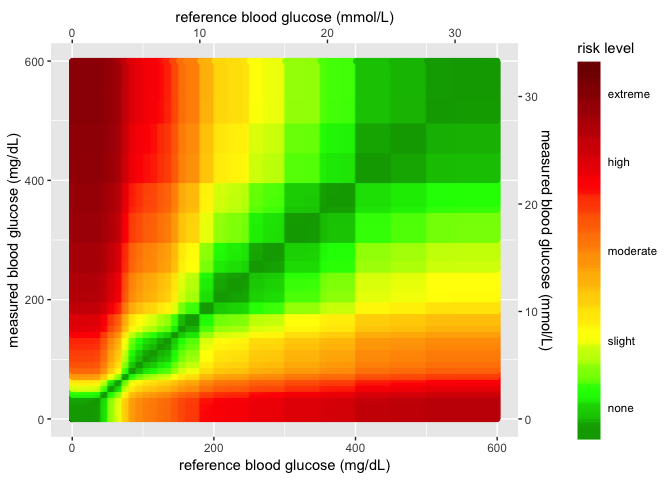
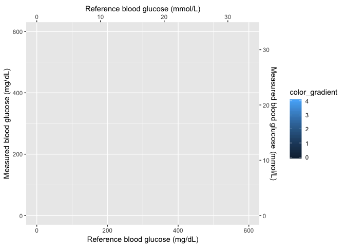
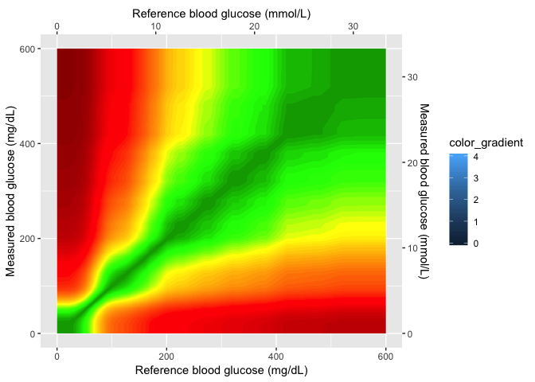

SEG - ggplot2
================
Martin Frigaard

## The packages

These are the packages you’ll need to reproduce this page:

``` r
library(tidyverse)
library(magrittr)
library(shiny)
library(rsconnect)
library(gplots)
library(tools)
library(jpeg)
library(png)
```

## The Data inputs

In order to create the SEG graphs, I need to load a few data inputs from
Github.

``` r
# HEAT MAP DATA INPUTS ============= ----
# download AppRiskPairData.csv from github  ---- ---- ---- ----
github_root <- "https://raw.githubusercontent.com/mjfrigaard/seg-shiny-data/master/"
app_riskpair_repo <- "Data/AppRiskPairData.csv"
# download to data repo
if (!file.exists("data/")) {
  dir.create("data/")
}
# download Riskpairdata --------
utils::download.file(url = paste0(github_root, app_riskpair_repo), 
                     destfile = "data/Riskpairdata.csv")
# download Sampledata data --------
samp_meas_data_rep <- "Data/FullSampleData.csv"
utils::download.file(url = paste0(github_root, samp_meas_data_rep), 
                     destfile = "data/Sampledata.csv")
# download VanderbiltComplete data --------

vand_comp_data_rep <- "Data/VanderbiltComplete.csv"
utils::download.file(url = paste0(github_root, vand_comp_data_rep), 
                     destfile = "data/VanderbiltComplete.csv")

# Read in the RiskPairData & SampMeasData
RiskPairData <- readr::read_csv(file = "data/Riskpairdata.csv")
SampMeasData <- readr::read_csv(file = "data/Sampledata.csv")
VanBltComp <- readr::read_csv(file = "data/VanderbiltComplete.csv")

#  mmol conversion factor ---- -----
mmolConvFactor <- 18.01806
#  rgb2hex function ---- -----
# This is the RGB to Hex number function for R
rgb2hex <- function(r, g, b) rgb(r, g, b, maxColorValue = 255)
#  risk factor colors ----  -----
# These are the values for the colors in the heatmap.
abs_risk_0.0000_color <- rgb2hex(0, 165, 0)
# abs_risk_0.0000_color
abs_risk_0.4375_color <- rgb2hex(0, 255, 0)
# abs_risk_0.4375_color
abs_risk_1.0625_color <- rgb2hex(255, 255, 0)
# abs_risk_1.0625_color
abs_risk_2.7500_color <- rgb2hex(255, 0, 0)
# abs_risk_2.7500_color
abs_risk_4.0000_color <- rgb2hex(128, 0, 0)
# abs_risk_4.0000_color
riskfactor_colors <- c(
  abs_risk_0.0000_color,
  abs_risk_0.4375_color,
  abs_risk_1.0625_color,
  abs_risk_2.7500_color,
  abs_risk_4.0000_color
)
#  create base_data data frame ---- ----- 
base_data <- data.frame(
  x_coordinate = 0,
  y_coordinate = 0,
  color_gradient = c(0:4)
)
```

## The `RiskPairData`

This data has columns and risk pairs for both `REF` and `BGM`, and the
`RiskFactor` variable for each pair of `REF` and `BGM` data. Below you
can see a sample of the `REF`, `BGM`, `RiskFactor`, and `abs_risk`
variables.

``` r
RiskPairData %>% 
  dplyr::sample_n(size = 10) %>% 
  dplyr::select(REF, BGM, RiskFactor, abs_risk)
```

    ## # A tibble: 10 x 4
    ##      REF   BGM RiskFactor abs_risk
    ##    <dbl> <dbl>      <dbl>    <dbl>
    ##  1   185   176      0.399    0.399
    ##  2   277   233      0.232    0.232
    ##  3   573   125      1.98     1.98 
    ##  4    23   332     -3.55     3.55 
    ##  5   491   204      1.02     1.02 
    ##  6   358   578     -0.517    0.517
    ##  7   135   566     -2.62     2.62 
    ##  8   265   476     -0.934    0.934
    ##  9   115   353     -2.38     2.38 
    ## 10   251   509     -1.05     1.05

## The `SampMeasData`

This data set mimics a blood glucose monitor, with only `BGM` and `REF`
values.

``` r
SampMeasData %>% 
  dplyr::sample_n(size = 10) %>% 
  dplyr::select(REF, BGM)
```

    ## # A tibble: 10 x 2
    ##      REF   BGM
    ##    <dbl> <dbl>
    ##  1   212   220
    ##  2    53    55
    ##  3   117   110
    ##  4   113   103
    ##  5   185   181
    ##  6   232   201
    ##  7   130   125
    ##  8   111    96
    ##  9   106   106
    ## 10   125   124

# Motivation

This document creates the `ggplot2` heatmap in the [SEG
application](https://www.diabetestechnology.org/seg/). In earlier
versions of the application, the heatmap background wasn’t smoothed like
the Excel application, so I decided to write up how I changed the graph
using a pre-made .png image.

## The original (Excel) SEG image

This image is from the Excel
application.

<!-- -->

## The current ggplot2 image

The steps/code to create the current `ggplot2` image is below.

``` r
# 1 - base layer ---- ---- ---- ---- ---- ---- ---- ----
base_layer <- ggplot() +
  geom_point(
    data = base_data, # defines data frame
    aes(
      x = x_coordinate,
      y = y_coordinate,
      fill = color_gradient
    )
  ) # + # uses x, y, color_gradient
# 2 - risk pair data layer  ---- ---- ---- ---- ---- ---- ---- ----
risk_layer <- base_layer +
  geom_point(
    data = RiskPairData, # new data set
    aes(
      x = REF, # additional aesthetics from new data set
      y = BGM,
      color = abs_risk
    ),
    show.legend = FALSE
  )  +
  ggplot2::scale_color_gradientn(
    colors = riskfactor_colors, # these are defined above with rgb2hex function
    guide = "none",
    limits = c(0, 4),
    values = scales::rescale(c(
      0, # darkgreen
      0.4375, # green
      1.0625, # yellow
      2.7500, # red
      4.0000
    ))
  )
# 3 - add color gradient  ---- ---- ---- ---- ---- ---- ---- ---- ---- 
risk_level_color_gradient <- risk_layer +
  ggplot2::scale_fill_gradientn( # scale_*_gradientn creats a n-color gradient
    values = scales::rescale(c(
      0, # darkgreen
      0.4375, # green
      1.0625, # yellow
      2.75, # red
      4.0 # brown
    )), 
    limits = c(0, 4),
    colors = riskfactor_colors,
    guide = guide_colorbar(
      ticks = FALSE,
      barheight = unit(100, "mm")
    ),
    breaks = c(
      0.25,
      1,
      2,
      3,
      3.75
    ),
    labels = c(
      "none",
      "slight",
      "moderate",
      "high",
      "extreme"
    ),
    name = "risk level"
  )
# 4 - add x and y axis  ---- ---- ---- ---- ---- ---- ---- ---- ---- 
# Add the new color scales to the scale_y_continuous()
heatmap_plot <- risk_level_color_gradient +
  ggplot2::scale_y_continuous(
    limits = c(0, 600),
    sec.axis =
      sec_axis(~. / mmolConvFactor,
        name = "measured blood glucose (mmol/L)"
      ),
    name = "measured blood glucose (mg/dL)"
  ) +
  scale_x_continuous(
    limits = c(0, 600),
    sec.axis =
      sec_axis(~. / mmolConvFactor,
        name = "reference blood glucose (mmol/L)"
      ),
    name = "reference blood glucose (mg/dL)"
  )
heatmap_plot
```

<!-- -->

When we re-create the graph using the risk pair data, we get see sharp
edges for values over 400 mg/dL and \~ 22 mmol/L. This is because of the
relationships between the `RiskFactor` and `BGM` / `REF` values.

## `RiskFactor` vs. `BGM`/`REF`

If we look at `RiskFactor` as a function of `seg_val`, we see the
following.

``` r
RiskPairData %>% 
  tidyr::gather(key = "seg_key", 
                value = "seg_val", 
                c(REF, BGM)) %>% 
  ggplot(aes(x = seg_val, y = RiskFactor, group = seg_key)) + 
    geom_point(aes(color = seg_key), alpha = 1/8, size = 0.5)
```

<!-- -->

The values of `RiskFactor` do not change much for the `BGM` and `REF`
values of 400-450, 450-500, and 500-600.

## Plot `abs_risk` VS `REF`/`BGM`

If we plot the absolute value of the `RiskFactor`, we see the same shape
to the points.

``` r
RiskPairData %>% 
  tidyr::gather(key = "seg_key", 
                value = "seg_val", 
                c(REF, BGM)) %>% 
  ggplot(aes(x = seg_val, y = abs_risk, group = seg_key)) + 
    geom_point(aes(color = seg_key), alpha = 1/8, size = 0.5)
```

<!-- -->

The same lines are seen when the absolute value of `RiskFactor` is
plotted against the `BGM` and `REF` values. This explains why the plot
below looks the way it does. The sharp lines are a result of the minimal
change in `RiskFactor` (or `abs_risk`) for `BGM` and `REF` values of
400-450, and 500-600.

## The Guassian smoothed image

This is the image from the excel file.

``` r
download.file(url = paste0(github_root,"Image/seg600.png?raw=true"), 
              destfile = "image/seg600.png")
```

<!-- -->

I can use this in the plot as a base image and layer the points from the
sample data on top.

## Upload the Gaussian image

Load the image into RStudio and assign it to an object with
`png::readPNG()`.

``` r
# read in as png
BackgroundSmooth <- png::readPNG("image/seg600.png")
```

## Layer 1 (axes and color gradient)

This is the new plot without any data added to the image. All I do here
is create the x and y axes and set a four-point color gradient.

``` r
base_layer <- base_data %>% 
  ggplot(aes(
      x = x_coordinate,
      y = y_coordinate,
      fill = color_gradient)) +
  geom_point(size = 0.00000001,
             color = "white")
scales_layer <- base_layer + 
  ggplot2::scale_y_continuous(
    limits = c(0, 600),
    sec.axis =
      sec_axis(~. / mmolConvFactor,
        name = "Measured blood glucose (mmol/L)"
      ),
    name = "Measured blood glucose (mg/dL)"
  ) +
  scale_x_continuous(
    limits = c(0, 600),
    sec.axis =
      sec_axis(~. / mmolConvFactor,
        name = "Reference blood glucose (mmol/L)"
      ),
    name = "Reference blood glucose (mg/dL)"
  )
scales_layer
```

<!-- -->

## Layer 2 (Gaussian image)

This is the Gaussian image layer. Now that I have the axes set, I can
set the `xmin`, `xmax`, `ymin`, and `ymax` values in my plot.

``` r
gaussian_layer <- scales_layer +
  ggplot2::annotation_custom(
    grid::rasterGrob(image = BackgroundSmooth, 
                               width = unit(1,"npc"), 
                               height = unit(1,"npc")), 
                               xmin = 0, 
                               xmax =  600, 
                               ymin = 0, 
                               ymax =  600) 
gaussian_layer
```

<!-- -->

## Layer 3 (color gradient)

In this layer I add the color gradient scaling and coloring, and also
the cutom labels for each level.

``` r
gaussian_gradient_layer <- gaussian_layer + 
    ggplot2::scale_fill_gradientn( # scale_*_gradientn creats a n-color gradient
    values = scales::rescale(c(
      0, # darkgreen
      0.4375, # green
      1.0625, # yellow
      2.75, # red
      4.0 # brown
    )), 
    limits = c(0, 4),
    colors = riskfactor_colors,
    guide = guide_colorbar(
      ticks = FALSE,
      barheight = unit(100, "mm")
    ),
    breaks = c(
      0.25,
      1,
      2,
      3,
      3.75
    ),
    labels = c(
      "none",
      "slight",
      "moderate",
      "high",
      "extreme"
    ),
    name = "risk level")
gaussian_gradient_layer
```

<!-- -->

## Layer 4 (sample data)

In the final layer, I add the sample data to the plot.

``` r
heatmap_plot <- gaussian_gradient_layer +
  geom_point(
    data = SampMeasData, # introduce sample data frame
    aes(
      x = REF,
      y = BGM
    ),
    shape = 21,
    fill = "white",
    size = 1.1,
    stroke = 0.4,
    alpha = 0.8
  )
heatmap_plot
```

<!-- -->

Now I just need to add this to the applcation.
