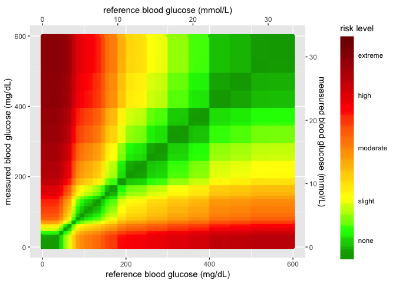
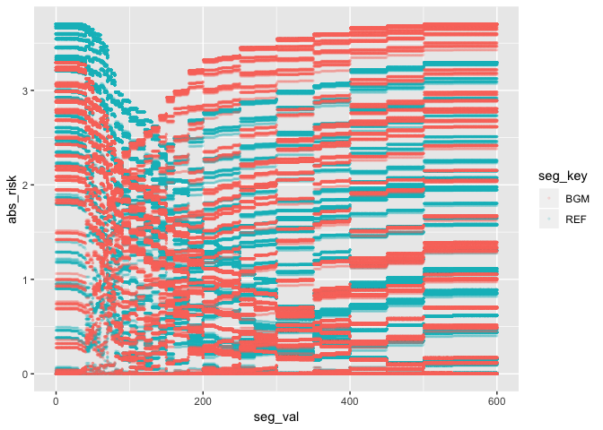
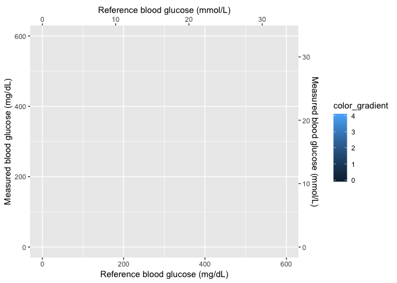
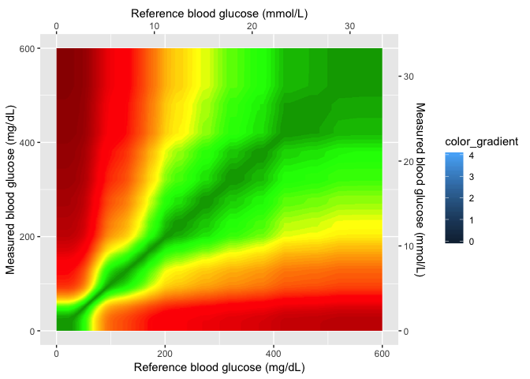
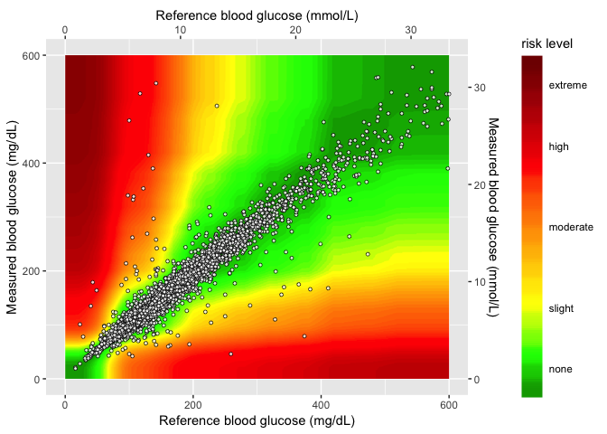

SEG - ggplot2
================
Martin Frigaard

# Background

This document outlines a graph I built for a [Shiny
application](https://n3wsandnumb3rs.shinyapps.io/seg-shiny-v-1-3-1/).

The interface accepts a single .csv file with two columns containing
blood glucose monitor measurements. These data get assigned a risk
factor value, and the Shiny app plots the values to visually display the
level of clinical risk in potentially inaccurate blood glucose monitors.
This graph is referred to as the Surveillance Error Grid (SEG). The app
also creates summary tables and a modified Bland-Altman plot.

In the first versions of the application, the SEG graph didn’t look very
clean because of the reference values used to create the underlying
plot. Below I describe the steps I took to figure out what was going on,
and the packages/methods I used to fix it.

**TOPICS COVERED:**

  - `ggplot2` for graphing

  - `png` for importing images

  - `grid::rasterGrob()` for creating a background in a `ggplot2` graph

  - lots of `dplyr` and `tidyr` for wrangling

## The packages

These are the packages you’ll need to reproduce this page:

``` r
library(tidyverse)
library(magrittr)
library(shiny)
library(rsconnect)
library(gplots)
library(tools)
library(jpeg)
library(png)
```

## The Data inputs

In order to create the SEG graphs and tables, I need to load a few data
inputs from Github. The code chunk below loads:

1.  `RiskPairData` -\> this assign a risk factor value to each BGM
    measurement
2.  `SampMeasData` -\> this is a small sample measurement dataset
3.  `VanBltComp` -\> this is a dataset from Vanderbilt used to create
    some of the initial calculations

<!-- end list -->

``` r
# HEAT MAP DATA INPUTS ============= ----
# download AppRiskPairData.csv from github  ---- ---- ---- ----
github_root <- "https://raw.githubusercontent.com/mjfrigaard/seg-shiny-data/master/"
app_riskpair_repo <- "Data/AppRiskPairData.csv"
# download to data repo
if (!file.exists("data/")) {
  dir.create("data/")
}
# download Riskpairdata --------
utils::download.file(url = paste0(github_root, app_riskpair_repo), 
                     destfile = "data/Riskpairdata.csv")
# download Sampledata data --------
samp_meas_data_rep <- "Data/FullSampleData.csv"
utils::download.file(url = paste0(github_root, samp_meas_data_rep), 
                     destfile = "data/Sampledata.csv")
# download VanderbiltComplete data --------

vand_comp_data_rep <- "Data/VanderbiltComplete.csv"
utils::download.file(url = paste0(github_root, vand_comp_data_rep), 
                     destfile = "data/VanderbiltComplete.csv")

# Read in the RiskPairData & SampMeasData
RiskPairData <- readr::read_csv(file = "data/Riskpairdata.csv")
```

    ## Parsed with column specification:
    ## cols(
    ##   RiskPairID = col_double(),
    ##   REF = col_double(),
    ##   BGM = col_double(),
    ##   RiskFactor = col_double(),
    ##   abs_risk = col_double()
    ## )

``` r
SampMeasData <- readr::read_csv(file = "data/Sampledata.csv")
```

    ## Parsed with column specification:
    ## cols(
    ##   BGM = col_double(),
    ##   REF = col_double()
    ## )

``` r
VanBltComp <- readr::read_csv(file = "data/VanderbiltComplete.csv")
```

    ## Parsed with column specification:
    ## cols(
    ##   BGM = col_double(),
    ##   REF = col_double()
    ## )

``` r
#  mmol conversion factor ---- -----
mmolConvFactor <- 18.01806
#  rgb2hex function ---- -----
# This is the RGB to Hex number function for R
rgb2hex <- function(r, g, b) rgb(r, g, b, maxColorValue = 255)
#  risk factor colors ----  -----
# These are the values for the colors in the heatmap.
abs_risk_0.0000_color <- rgb2hex(0, 165, 0)
# abs_risk_0.0000_color
abs_risk_0.4375_color <- rgb2hex(0, 255, 0)
# abs_risk_0.4375_color
abs_risk_1.0625_color <- rgb2hex(255, 255, 0)
# abs_risk_1.0625_color
abs_risk_2.7500_color <- rgb2hex(255, 0, 0)
# abs_risk_2.7500_color
abs_risk_4.0000_color <- rgb2hex(128, 0, 0)
# abs_risk_4.0000_color
riskfactor_colors <- c(
  abs_risk_0.0000_color,
  abs_risk_0.4375_color,
  abs_risk_1.0625_color,
  abs_risk_2.7500_color,
  abs_risk_4.0000_color
)
#  create base_data data frame ---- ----- 
base_data <- data.frame(
  x_coordinate = 0,
  y_coordinate = 0,
  color_gradient = c(0:4)
)
```

## The `RiskPairData`

This data has columns and risk pairs for both `REF` and `BGM`, and the
`RiskFactor` variable for each pair of `REF` and `BGM` data. Below you
can see a sample of the `REF`, `BGM`, `RiskFactor`, and `abs_risk`
variables.

``` r
RiskPairData %>% 
  dplyr::sample_n(size = 10) %>% 
  dplyr::select(REF, BGM, RiskFactor, abs_risk)
```

    ## # A tibble: 10 x 4
    ##      REF   BGM RiskFactor abs_risk
    ##    <dbl> <dbl>      <dbl>    <dbl>
    ##  1   516   588   -0.00254  0.00254
    ##  2   145   584   -2.41     2.41   
    ##  3   484   481    0        0      
    ##  4   478   340    0.514    0.514  
    ##  5   515   528    0        0      
    ##  6     3   178   -3.00     3.00   
    ##  7   476   116    1.98     1.98   
    ##  8   567   231    1.08     1.08   
    ##  9   431   236    0.931    0.931  
    ## 10   557   318    0.618    0.618

## The `SampMeasData`

This data set mimics a blood glucose monitor, with only `BGM` and `REF`
values.

``` r
SampMeasData %>% 
  dplyr::sample_n(size = 10) %>% 
  dplyr::select(REF, BGM)
```

    ## # A tibble: 10 x 2
    ##      REF   BGM
    ##    <dbl> <dbl>
    ##  1   120   134
    ##  2   149   142
    ##  3   131   132
    ##  4    86    90
    ##  5   162   152
    ##  6   151   144
    ##  7    96   106
    ##  8   119   125
    ##  9   111   106
    ## 10   376   335

## The `VanBltComp`

This larger data set contains blood glucose monitor measurements, with
only `BGM` and `REF` values.

``` r
VanBltComp %>% 
  dplyr::sample_n(size = 10) %>% 
  dplyr::select(REF, BGM)
```

    ## # A tibble: 10 x 2
    ##      REF   BGM
    ##    <dbl> <dbl>
    ##  1   164   152
    ##  2   118   125
    ##  3   122   107
    ##  4   135   157
    ##  5   163   153
    ##  6   162   148
    ##  7   297   283
    ##  8    78    89
    ##  9   199   187
    ## 10    71    68

# Motivating problem/issue

In earlier versions of the application, the heatmap background wasn’t
smoothed like the original Excel application. This file documents how I
changed the SEG graph using a pre-made .png image.

## The original (Excel) SEG image

This image is from the Excel
application.

<!-- -->

The points are plotted against a Gaussian smoothed background image.

## The current ggplot2 image

The steps/code to create the current `ggplot2` image are below (this
code will take a bit to run).

``` r
# 1 - base layer ---- ---- ---- ---- ---- ---- ---- ----
base_layer <- ggplot() +
  geom_point(
    data = base_data, # defines data frame
    aes(
      x = x_coordinate,
      y = y_coordinate,
      fill = color_gradient
    )
  ) # + # uses x, y, color_gradient
# 2 - risk pair data layer  ---- ---- ---- ---- ---- ---- ---- ----
risk_layer <- base_layer +
  geom_point(
    data = RiskPairData, # new data set
    aes(
      x = REF, # additional aesthetics from new data set
      y = BGM,
      color = abs_risk
    ),
    show.legend = FALSE
  )  +
  ggplot2::scale_color_gradientn(
    colors = riskfactor_colors, # these are defined above with rgb2hex function
    guide = "none",
    limits = c(0, 4),
    values = scales::rescale(c(
      0, # darkgreen
      0.4375, # green
      1.0625, # yellow
      2.7500, # red
      4.0000
    ))
  )
# 3 - add color gradient  ---- ---- ---- ---- ---- ---- ---- ---- ---- 
risk_level_color_gradient <- risk_layer +
  ggplot2::scale_fill_gradientn( # scale_*_gradientn creats a n-color gradient
    values = scales::rescale(c(
      0, # darkgreen
      0.4375, # green
      1.0625, # yellow
      2.75, # red
      4.0 # brown
    )), 
    limits = c(0, 4),
    colors = riskfactor_colors,
    guide = guide_colorbar(
      ticks = FALSE,
      barheight = unit(100, "mm")
    ),
    breaks = c(
      0.25,
      1,
      2,
      3,
      3.75
    ),
    labels = c(
      "none",
      "slight",
      "moderate",
      "high",
      "extreme"
    ),
    name = "risk level"
  )
# 4 - add x and y axis  ---- ---- ---- ---- ---- ---- ---- ---- ---- 
# Add the new color scales to the scale_y_continuous()
heatmap_plot <- risk_level_color_gradient +
  ggplot2::scale_y_continuous(
    limits = c(0, 600),
    sec.axis =
      sec_axis(~. / mmolConvFactor,
        name = "measured blood glucose (mmol/L)"
      ),
    name = "measured blood glucose (mg/dL)"
  ) +
  scale_x_continuous(
    limits = c(0, 600),
    sec.axis =
      sec_axis(~. / mmolConvFactor,
        name = "reference blood glucose (mmol/L)"
      ),
    name = "reference blood glucose (mg/dL)"
  )
heatmap_plot
```

<!-- -->

When we re-create the graph using the risk pair data, we get see sharp
edges for values over 400 mg/dL and \~ 22 mmol/L. This is because of the
relationships between the `RiskFactor` and `BGM` / `REF` values. I’ll
outline these two measurements below.

## `RiskFactor` vs. `BGM`/`REF`

If we look at `RiskFactor` as a function of `seg_val`, we see the
following.

``` r
RiskPairData %>% 
  tidyr::gather(key = "seg_key", 
                value = "seg_val", 
                c(REF, BGM)) %>% 
  ggplot(aes(x = seg_val, y = RiskFactor, group = seg_key)) + 
    geom_point(aes(color = seg_key), alpha = 1/8, size = 0.5)
```

<!-- -->

The values of `RiskFactor` do not change much for the `BGM` and `REF`
values of 400-450, 450-500, and 500-600.

## Plot `abs_risk` VS `REF`/`BGM`

If we plot the absolute value of the `RiskFactor`, we see a similar
pattern.

``` r
RiskPairData %>% 
  tidyr::gather(key = "seg_key", 
                value = "seg_val", 
                c(REF, BGM)) %>% 
  ggplot(aes(x = seg_val, y = abs_risk, group = seg_key)) + 
    geom_point(aes(color = seg_key), alpha = 1/8, size = 0.5)
```

<!-- -->

The same lines are seen when the absolute value of `RiskFactor` is
plotted against the `BGM` and `REF` values. This explains why the plot
below looks the way it does. The sharp lines are a result of the minimal
change in `RiskFactor` (or `abs_risk`) for `BGM` and `REF` values of
400-450, and 500-600.

## The Gaussian smoothed image

This is the image from the excel file.

<!-- -->

I can use this image in the plot as a background and layer the data
points from the sample data on top.

## Upload the Gaussian image

Load the image into RStudio and assign it to an object with
`png::readPNG()`.

``` r
# read in as png
BackgroundSmooth <- png::readPNG("images/seg600.png")
```

## Layer 1 (axes and color gradient)

This is the new plot without any data added to the image. All I do here
is create the x and y axes and set a four-point color gradient.

``` r
base_layer <- base_data %>% 
  ggplot(aes(
      x = x_coordinate,
      y = y_coordinate,
      fill = color_gradient)) +
  geom_point(size = 0.00000001,
             color = "white")
scales_layer <- base_layer + 
  ggplot2::scale_y_continuous(
    limits = c(0, 600),
    sec.axis =
      sec_axis(~. / mmolConvFactor,
        name = "Measured blood glucose (mmol/L)"
      ),
    name = "Measured blood glucose (mg/dL)"
  ) +
  scale_x_continuous(
    limits = c(0, 600),
    sec.axis =
      sec_axis(~. / mmolConvFactor,
        name = "Reference blood glucose (mmol/L)"
      ),
    name = "Reference blood glucose (mg/dL)"
  )
scales_layer
```

<!-- -->

## Layer 2 (Gaussian image)

This is the Gaussian image layer. Now that I have the axes set, I can
set the `xmin`, `xmax`, `ymin`, and `ymax` values in my plot.

``` r
gaussian_layer <- scales_layer +
  ggplot2::annotation_custom(
    grid::rasterGrob(image = BackgroundSmooth, 
                               width = unit(1,"npc"), 
                               height = unit(1,"npc")), 
                               xmin = 0, 
                               xmax =  600, 
                               ymin = 0, 
                               ymax =  600) 
gaussian_layer
```

<!-- -->

## Layer 3 (color gradient)

In this layer I add the color gradient scaling and coloring, and also
the custom labels for each level.

``` r
gaussian_gradient_layer <- gaussian_layer + 
    ggplot2::scale_fill_gradientn( # scale_*_gradientn creats a n-color gradient
    values = scales::rescale(c(
      0, # darkgreen
      0.4375, # green
      1.0625, # yellow
      2.75, # red
      4.0 # brown
    )), 
    limits = c(0, 4),
    colors = riskfactor_colors,
    guide = guide_colorbar(
      ticks = FALSE,
      barheight = unit(100, "mm")
    ),
    breaks = c(
      0.25,
      1,
      2,
      3,
      3.75
    ),
    labels = c(
      "none",
      "slight",
      "moderate",
      "high",
      "extreme"
    ),
    name = "risk level")
gaussian_gradient_layer
```

<!-- -->

## Layer 4 (sample data)

In the final layer, I add the sample data to the plot.

``` r
heatmap_plot <- gaussian_gradient_layer +
  geom_point(
    data = SampMeasData, # introduce sample data frame
    aes(
      x = REF,
      y = BGM
    ),
    shape = 21,
    fill = "white",
    size = 1.1,
    stroke = 0.4,
    alpha = 0.8
  )
heatmap_plot
```

<!-- -->

Now I just need to add this to the application.
